# clpwn-net-ctf original writeup
clpwn内で行った[clpwn net ctf]にて、今回のために作成した問題

- [i see](#i-see)
- [asciicmp](#asciicmpi)
- [a rot of txt](#a-rot)
- [終わりに](#end)

以上、三問のwriteupを記す。

## <a id="i-see"></a>i see
> 暗号化されていないプロトコルの通信は見えちゃいます。こういうので、重要な情報をやり取りするのは良くない。

**DL :** [i-see.pcapng](../problem/a-rot-of-txt/a_rot_of_txt.pcapng)<br>
<br>
問題文から、今回のパケットキャプチャのうち暗号化されてないプロトコルを確認してみます。<br>
[統計]->[プロトコル階層]を確認してみましょう。<br>

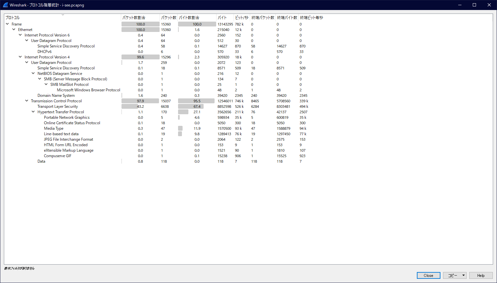

これを見ると、IPv4の通信の中のTCPの`Hypertext Transfer Protocol`、つまり`HTTP`が暗号化されていないプロトコルなので気になります。<br>
`Transport Layer Security(TLS)`の通信は暗号化されているので、他に復号の手掛かりが無いと確認できないので無視します。<br>
では、wiresharkのdisplay filterで`http`と入力し、パケットを`http`通信のみに絞ってみましょう。<br>

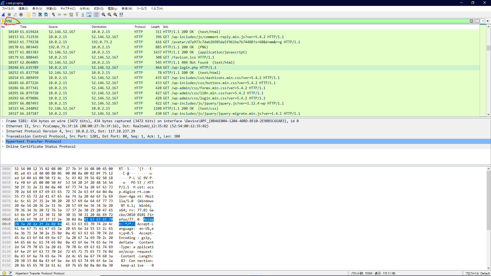

一応確認しておくと、display-filterはパケット一覧の上の入力フォームです。<br>
`http`通信に絞り、少しパケット追っていくと`wp`が含まれるアクセスが見受けられます。<br>
これは、[Wordpress](https://ja.wordpress.com/)で運営されているサイトへのアクセスを表します。<br>
さらに少し進むと、`wp-login.php`へのアクセスが見られます。これは、Wordpressの管理画面へのログイン試行を示します。<br>
今回の場合、http通信でのログイン試行なのでログインを行った場合のユーザ名とパスワードが見れそうです。<br>
ここで、一般にログインのためのユーザ名とパスワードを送るための通信は`HTTP`の`POST`メソッドが利用されることが一般的です。<br>
`wp-login.php`へのアクセスの見られるパケットから少し進むと見つけられますが、せっかくなのでwiresharkのdisplay-filterで`HTTP`の`POST`メソッドのみを表示するようにしてみましょう。<br>
wiresharkのdisplay filterで`http.request.method == "POST"`と入力してください。<br>

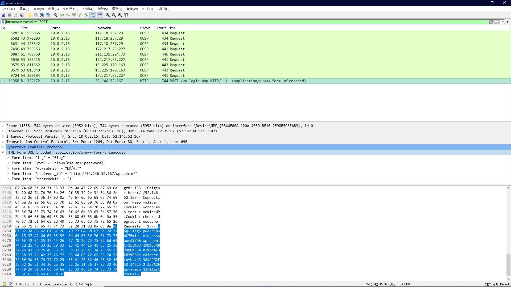

この中で、`wp-login.php`に`POST`しているパケットでユーザ名とパスワードが送られています。<br>
*flag* : **clpwn{mie_mie_password}**

### flagへの近道
- この通信の中身がある程度理解できていれば、[分析]->[追跡]->[TCPストリーム]を眺めるだけでもflagは見つかります。
- flagが平文で見られそうなとき、今回のようなケースでは`tcp matches "clpwn%7b"`ようなdisplay-filterも有効です。


## <a id="asciicmpi"></a>asciicmp
> icmpはping等ネットワークの疎通のときとかによく見かけます。 あれ、でもこれは何か変じゃない？

**DL :** [asciicmp.pcapng](../problem/asciicmp/asciicmp.pcapng)<br>
<br>
まず、問題文通り与えられたパケットキャプチャにて`icmp`通信を見ると、何か変なところがありますね。
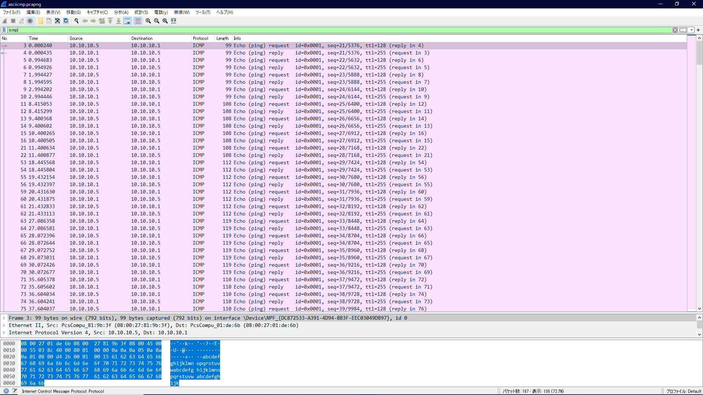


ここで、何かが変だと気づけるかどうかは経験によるものがあります。<br>
今回の`icmp`の通信は、`Echo (ping) request`,`Echo (ping) reply`から`ping`コマンドが実行された時のものだと分かります。<br>
何が変なのか気づけなかった場合は、手元でicmpによる通信を発生させて見比べてみましょう。<br>
ここで、パケットキャプチャを行う場合はwiresharkを管理者権限で実行しないとキャプチャできません。<br>
管理者権限で実行した後に、下の方にインターフェースが出るのでyoutube等を再生して通信が確認できたものをクリックして、パケットキャプチャを開始します。<br>

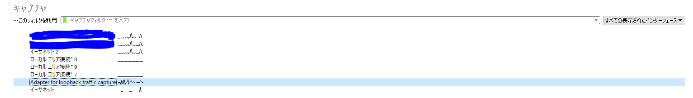

インターフェースが選択できたら、`icmp`の通信に絞って見ていきましょう。
```
# Windows(cmd,powershell)
> ping 8.8.8.8

# Linux or Mac(terminal....)
$ ping 8.8.8.8
```
このコマンドの実行時の`icmp`の通信をパケットキャプチャしてみてください。<br>
ちなみに、`8.8.8.8`は[Google Public DNS]のipアドレスでDNSサーバとして設定すると早いとよく言われるやつです。結局ISPに指定されたDNSの方が早いこともあるんですけどね。また、ネット接続に問題が起きていそうなときにマシンがインターネットに接続できているか`ping 8.8.8.8`を実行してよく確認します。<br>

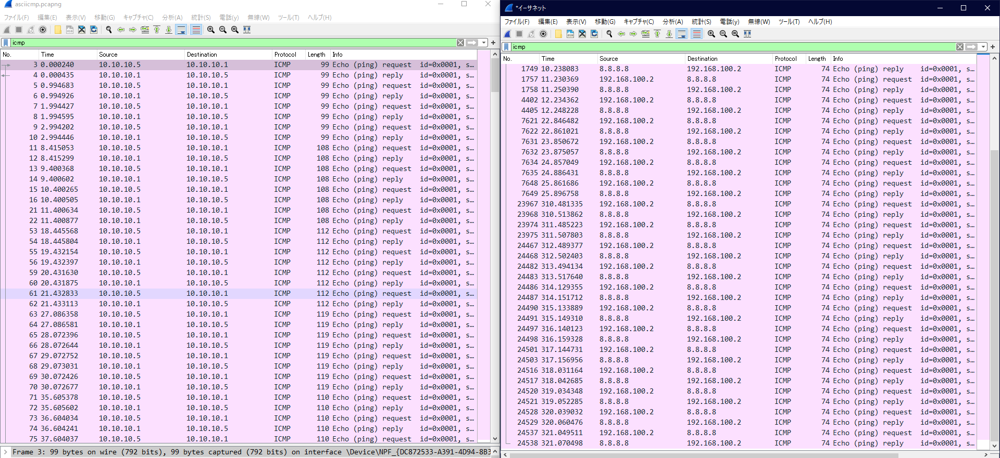

さあ、asciicmp(左)と手元のキャプチャ(右)を比べると、それぞれが同じipアドレスへの`ping`であるに関わらず、asciicmpの方は`Length`が一定期間で変わっていることが分かります。<br>
本来、ただ`ping`を実行しただけでこのような変化は起こりません。これは何か怪しいです。<br>
ここで、問題名に戻ります。この問題は[asciicmp]です。`icmp`はありますが、`ascii`はどこにあるのでしょう。もうお気づきの通り、不自然に変化している`Length`が文字に代わります。<br>
asciiを知らなかった人は、ここで覚えてください。[asciiコード](https://www.k-cube.co.jp/wakaba/server/ascii_code.html)と呼ばれる10進、16進と文字列を変換するものがあります。コンピュータの文字コードの基本として使われているものなので覚えておいてください。<br>
では、今回は10進のようなので例えば[CyberChef](https://gchq.github.io/CyberChef/)等を利用して10進数からasciiコードによる文字列変換を行ってみましょう。

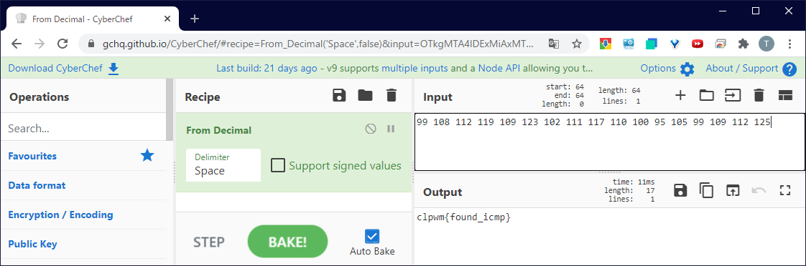

このように、flagが見つかりました。<br>
*flag* : **clpwn{found_icmp}**


## <a id="a-rot"></a>a rot of txt
> 重要なファイルとは別に、passwordを書いたpassword.txtを送りました。password自体は、ずらしてませんよ。

**DL :** [a_rot_of_txt.pcapng](../problem/a-rot-of-txt/a_rot_of_txt.pcapng)<br>
<br>

---
まず謝罪文から。今回は、FTPの通信からファイルを復元してflagを見つけてもらうという問題でしたが、ファイルをバイナリモードで送っていなかったので実質解けない問題になってしまっていたことを謝罪致します。誠に申し訳ございません。上にあるファイルは修正済みのものなので存分にチャレンジして頂いてflagをゲットしてください。

---

与えられたパケットキャプチャを見ると、ほとんどが`ftp`の通信だと思われます。<br>

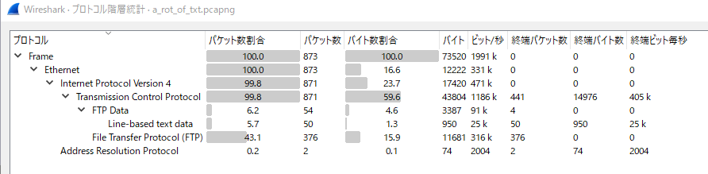

では、`ftp-data`に絞って見てみましょう。大まかに見てみると、`txt`を沢山送る中で`flag.zip`がいくつか送られているようです。<br>

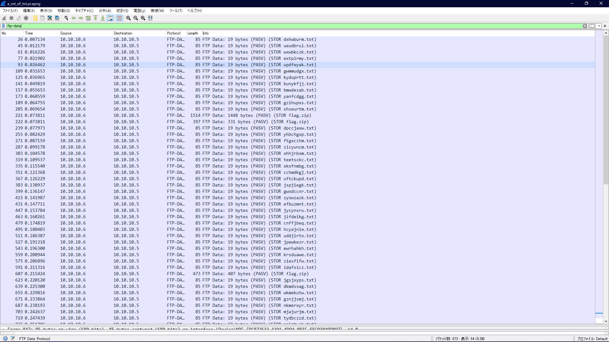

送られているファイルを確認するために、それぞれ`flag.zip`が送られているパケットで`TCPストリーム`を確認します。<br>
ここでは、各々のzipの`TCPストリーム`を[Raw形式]で表示し[Save as...]を選択することでファイルの復元が行えます。<br>
(※`ftp`にてバイナリモードで送信されている場合は復元できるが、テキストモードの場合は復元できない。そもそも、バイナリモードでテキスト以外のファイルを送受信した場合ファイルが破損する。忘れてたぁ（´・ω・｀）。)<br>
とりあえず順に、[flag-first.zip],[flag-second.zip],[flag-third.zip]として保存しておきましょう。<br>

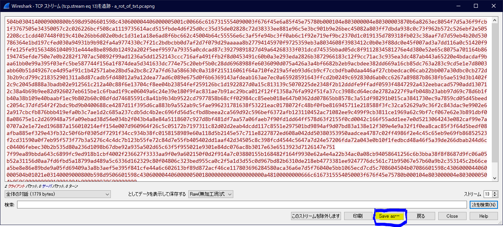

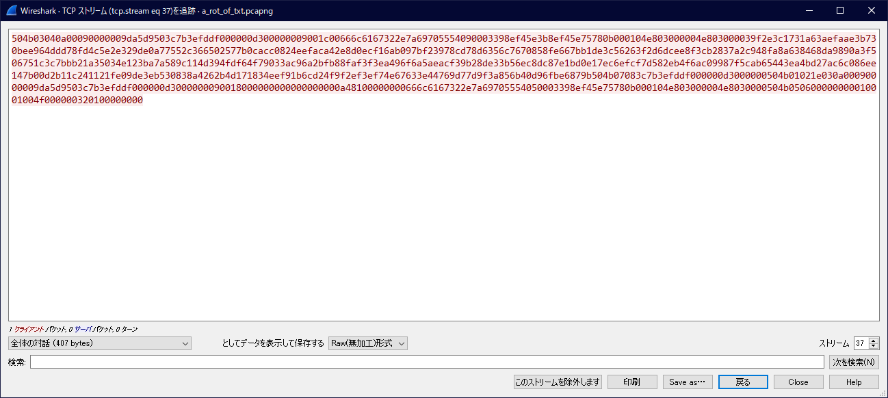

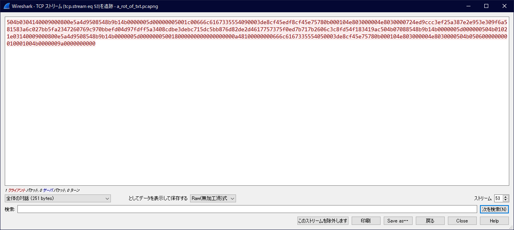

そうして、開いてみると<br>

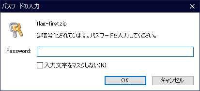

パスワードが要求されました。他のzipファイルも同様にパスワードが必要なようです。<br>
では、ここで問題文に戻ります。

> 重要なファイルとは別に、passwordを書いたpassword.txtを送りました。password自体は、ずらしてませんよ。

問題文からzipの`password`は`password.txt`に書かれているようです。しかし、`password.txt`というファイルは送られていません。どういうことでしょうか。ここで、[a rot of txt]という問題名を思い出してください。`lot`ではなく`rot`は単語として間違っていますが、これはタイポではありません。意図的なヒントです。<br>
沢山の`txt`は訳の分からないファイル名をしています。これと、`rot`という言葉を見ると何かに結びつきませんか。そうです。この`rot`は、シーザー暗号が利用されていることを示しています。つまり、`password.txt`はファイル名が`rot`で変換されているのではないかと推測できます。<br>
`rot`でよく使われるのは`rot13`です。これを`password`に適用すると、<br>
```
password -> cnffjbeq
```
このファイルは果たしてあるのか。<br>

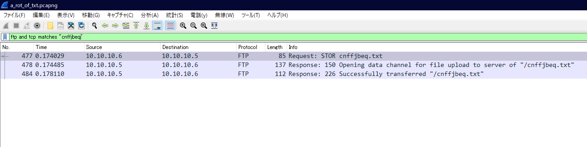

(ここでは`ftp and tcp matches "cnffjbeq"`で検索している)<br>
ありましたね。では、改めて`ftp-data`で探し、ファイルの中身を見てみます。<br>

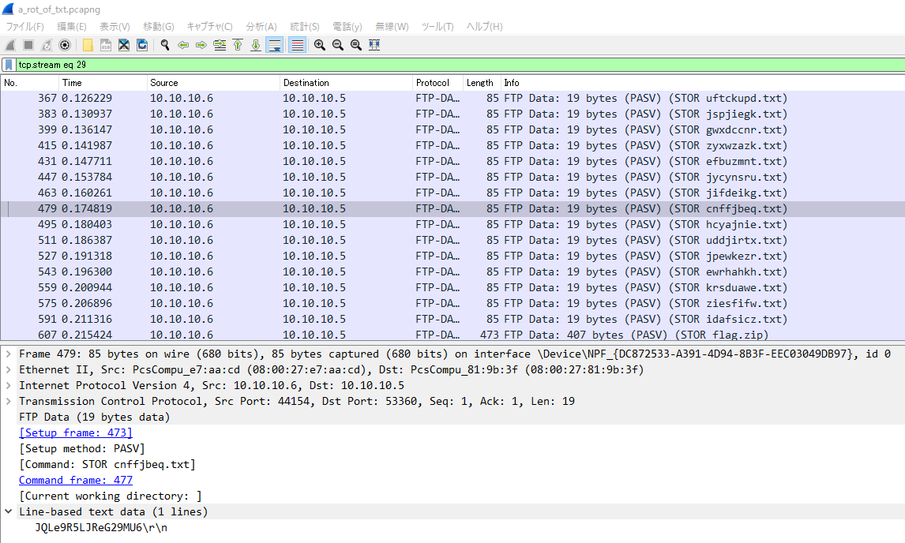

これで、zipファイルが開けるハズです。解凍すると、それぞれのzipファイルから`flag1`,`flag2.zip`,`flag3`というファイルが取り出せます。<br>
まず、`flag1`から見ていきましょう。
```
$ file file1
flag1: PNG image data, 150 x 150, 8-bit colormap, non-interlaced
```
PNGイメージのようなので、`eog`か何か画像ビューワーで開きましょう。


次に、`flag2.zip`を見ていきます。
```
$ file file2.zip
flag2.zip: Zip archive data, at least v1.0 to extract
```
これはzipファイルのようですね。解凍してみましょう。<br>
```
$ unzip flag2.zip 
Archive:  flag2.zip
 extracting: flag2?.txt              
$ cat cat flag2\?.txt 
flag2 isn't here.
```
さて、どういうことでしょうか。先ほど、`flag1`はPNGイメージでflagが書いてありました。もしかすると、この場合`flag2.zip`自体にflagが書いてあるのではないかと考えてみましょう。
```
$ strings flag2.zip 
flag2?.txtUT	
flag2 isn't here.
flag2?.txtUT
flag2>is_complete<flag2PK
```
やはり、`flag2.zip`自体にflagがあったようです。<br>
では、`flag3`を見てみましょう。
```sh
$ file file3
flag3: ELF 64-bit LSB shared object, x86-64, version 1 (SYSV), too many program (10762)
```
`elf`ファイルということは実行ファイルですね。ここで、気づく人は気づくと思いますが変なところに気づかなかった想定でいきます。本来、出元の不明な実行ファイルは実行すべきではありませんが今回はctfのためのファイルなので気にしなくても良いです。実行してみましょう。
```
$ chmod 700 flag3
$ ./flag3 
bash: ./flag3: バイナリファイルを実行できません: 実行形式エラー
```
エラーを吐いたということは実行ファイルでは無いかもしれません。軽く中身を覗いてみましょう。
```
strings flag3
34763576345
***flag3***
ly_visible}
***flag3***
```
これは、実行ファイルに見せかけたシグネチャを含んだファイルであったようです。<br>
ここまでで、`clpwn{`から始まり、`}`で終わる文字列が見つかったのでflag getchu!<br>

*flag* : **clpwn{ftp_is_completely_visible}**

## wireshark display-filter関連資料
[技術レポート「Wiresharkの活用法 その３ ～表示フィルタで絞り込む～」｜ソフテックだより｜株式会社ソフテック](https://www.softech.co.jp/mm_190807_tr.htm)<br>
[wireshark-filter - The Wireshark Network Analyzer 3.2.4](https://www.wireshark.org/docs/man-pages/wireshark-filter.html)<br>
[Wireshark · Display Filter Reference: Index](https://www.wireshark.org/docs/dfref/)<br>

# <a id="end"></a>終わりに
今回のctfはいかがだったでしょうか。勉強会でwiresharkを簡単に学び、発展を含めてctfを通して身に着けて欲しいということで問題に取り組んでもらいました。<br>
実際にはctfにはパケットキャプチャを見るような問題は少ないですが、今回の問題が解けるくらいの知識、技術、ひらめきや考え方は必要です。<br>
また、分からない用語や分からない知識が度々登場したという人もいると思います。各自で復習や調べてみてください。さらに言えば、ctfの問題というものは先に学んでおけば解けるというものではなく、その問題で初めましてというようなものが多いと思います。<br>
常に初めましての連続の中で、如何に上手く検索するか調べるか、直接辿り着けなくても持っている情報のみで気転を利かせることができるかどうかといった能力が問われます。<br>
この力を養えばctfのみでなく、人生における様々な局面での活用が見込めることは間違いないので、継続的に、自主的に、他にもctfに取り組んで頑張って頂きたいです。<br>
そういえば、ctfサーバや問題作成について簡単なまとめを[ココ](../ctf-management/readme.md)に置いておきますね。
